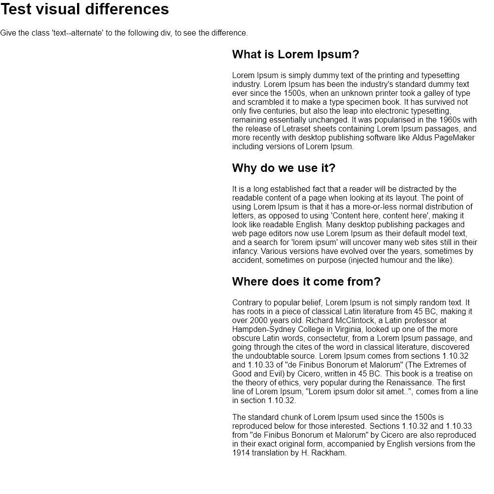
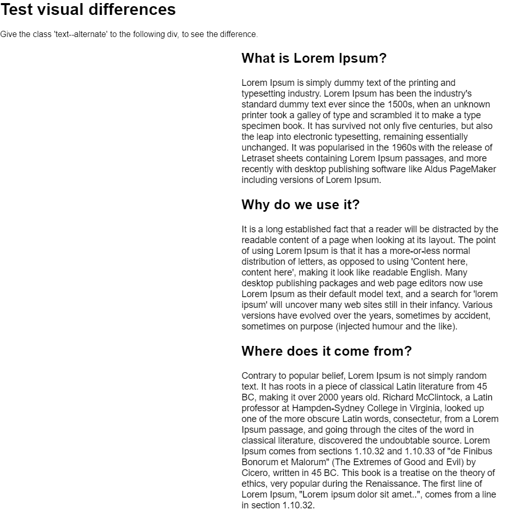
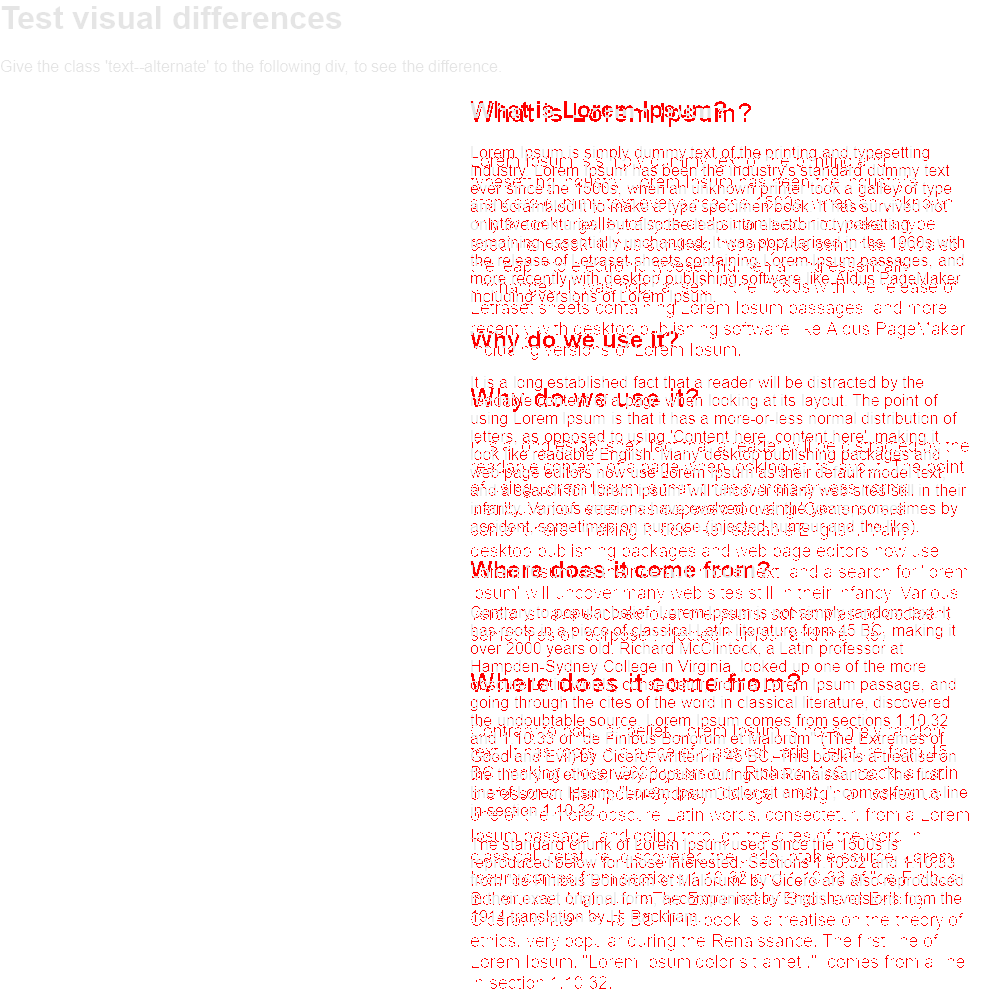

# ember-visual-test

Test screens in acceptance tests for visual changes over time.

## Installation

* `ember install ember-visual-test`

## Usage

Use ember-visual-test in your acceptance tests like this:

```js
import { test } from 'qunit';
import moduleForAcceptance from '../../tests/helpers/module-for-acceptance';
import { capture } from 'ember-visual-test/test-support/helpers';

moduleForAcceptance('Acceptance | visual test');

test('visiting /', async function(assert) {
  let testBody = document.querySelector('#ember-testing');

  await visit('/');

  assert.equal(currentURL(), '/');

  await capture(assert, testBody, 'test-file-name');
});
```

## How does it work?

Whenever `capture` is called in the test, it will make a screenshot of the given element with [html2canvas](http://html2canvas.hertzen.com/), and save it in the `/visual-test-output` folder. Please commit this folder into source control!

Now, whenever the test is run, a new snapshot is made and put in the `/visual-test-output/tmp` folder (do NOT put that into source control!). It then compares the two images with [pixelmatch](https://github.com/mapbox/pixelmatch) and asserts accordingly. If a mismatch is found, it will save an image with the diff of the two versions in the `/visual-test-output/diff` folder, to help you identify the issue.

Note that this means that if a screen changes consciously, you'll need to either manually delete that image from the `/visual-test-output` folder, or run `ember visual-test:reset` to reset ALL images.

### Example

For example, imagine you had an image like this the first time you ran the capture:



Now, after some changes, you run the tests again, and this time, it captures this image:



This would result in an error, and generate the following diff image:



## API docs

### capture
 
The capture function takes three parameters: `capture(assert, element, identifier)`

* `assert`: The assert function. If this is null, no assert will be made, 
and instead an object with data about the success/error of the test will be returned 
(don't forget to `await` on it!).
* `element`: Either a DOM node, or a string which will be used in `document.querSelector()`
* `identifier`: A unique string to identify this capture. This will be the file name of the generated images, and has to be unique across your whole application.

### CLI

There are also two CLI commands to use: 

* `ember visual-test:clean`: Clean the diff/tmp folders
* `ember visual-test:reset`: Manually clean all folders & create new baseline images

## FAQ / Issues

Note that there might be issues if the tests are run in different browsers/browser sizes. Ideally, they are always run in CLI to ensure stable results.

Also note that html2canvas has some quirks, and not everything might be perfect. But usually, results should still remain the same in multiple runs.
